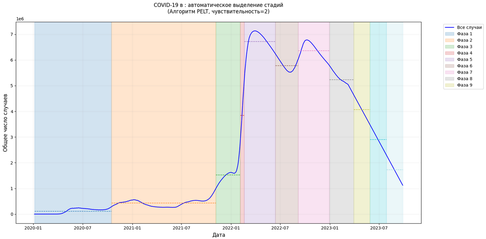

# Выпускная квалификационная работа  
**Тема:** Прогнозирование эпидемиологической динамики с использованием методов машинного обучения  
**Автор:** Озеров Владимир Константинович                                           
 **Группа:** М8О-406Б-21

## Описание проекта  
Объектом исследования является эпидемиологическая динамика, представленная временными рядами данных о популяции, включая показатели заболеваемости, выздоровлений и других параметров. 
Цель работы — разработка модели машинного обучения для прогнозирования динамики распространения заболеваний, способной учитывать сложные зависимости в данных.
 

## Данные  
Исходные данные для исследования были взяты из открытых источников:  
- **Данные о профилактических мерах** (OxCGRT): https://github.com/OxCGRT/covid-policy-tracker](https://github.com/OxCGRT/covid-policy-tracker)  
- **Данные о заболевших, выздоровевших и других группах** (Our World in Data): https://github.com/owid/covid-19-data/tree/master/public/data)  

## Файлы проекта  
| Файл                  | Назначение                                                                 |
|-----------------------|---------------------------------------------------------------------------|
| `SIRF.ipynb`          | Выделение параметров SIRF         |
| `phases.ipynb`        | Анализ фаз развития эпидемии                              |
| `wheighting.ipynb`    | Взвешивание значимости фаз развития эпидемии  |
| `model.ipynb`         | Основная расчётная модель                         |

## Результаты
|  |
|:-----------------------------------:|
| *Рис. 1. Реальные и предсказанные случаи заражения.* |

|  |
|:-----------------------------------:|
| *Рис. 2. Динамика кумулятивного числа подтвержденных случаев для России.* |

|  |
|:-----------------------------------:|
| *Рис. 3. Сравнение MAPE различных моделей прогнозирования.* |

|  |
|:-----------------------------------:|
| *Рис. 4. Сравнение MAE различных моделей прогнозирования.* |

|  |
|:-----------------------------------:|
| *Рис. 5. Сравнение Adjusted R² различных моделей прогнозирования.* |

